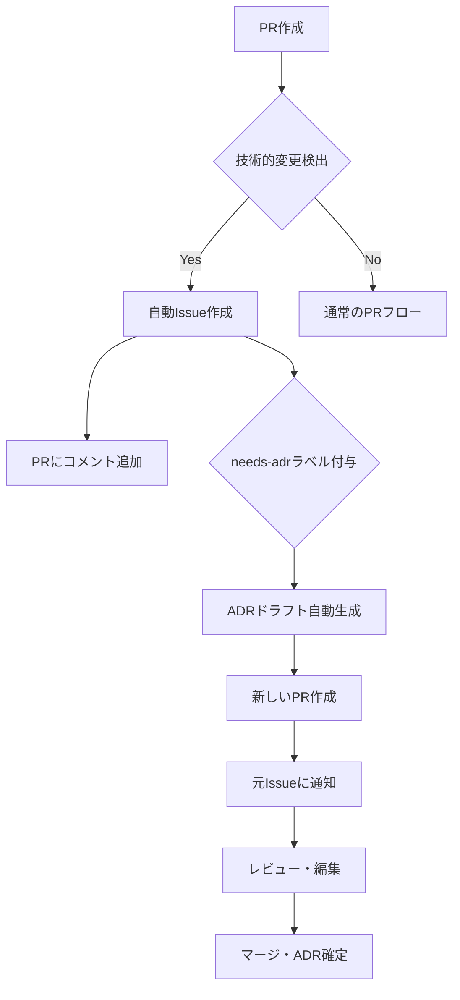

# ADR自動化システム

Claude Commandsプロジェクトでは、重要な技術的決定を効率的に追跡・記録するため、ADR（Architecture Decision Records）の自動化システムを導入しています。

## 🤖 自動化の概要

### A. GitHub Issue自動作成
プルリクエストを分析して、技術的決定が必要な変更を自動検出し、対応するIssueを作成

### B. ADRドラフト自動生成  
検出されたIssueに基づいて、ADRドラフトファイルとプルリクエストを自動生成

## 🔍 自動検出の対象

以下のファイル変更が検出されると、自動的にADR検討が必要と判断されます：

### 高優先度（High Priority）
- `supabase/**` - データベース設計変更
- `src/lib/**` - アーキテクチャ変更  
- `middleware.ts`, `next.config.ts` - 設定・ミドルウェア変更

### 中優先度（Medium Priority）
- `package.json`, `package-lock.json` - 依存関係変更
- `src/components/ui/**` - UI戦略変更
- `tailwind.config.ts`, `tsconfig.json` - 設定変更

## 📋 自動化フロー



## 🛠️ システム構成

### GitHub Actions ワークフロー

#### 1. ADR Analysis (`adr-analysis.yml`)
**トリガー**: PR作成・更新時
**機能**:
- ファイル変更の分析
- 技術的決定の自動検出
- Issue自動作成
- PR自動コメント

#### 2. ADR Draft Generator (`adr-draft-generator.yml`)
**トリガー**: `needs-adr`ラベル付与時
**機能**:
- Issue内容の解析
- ADRドラフトファイル生成
- 新規ブランチ・PR作成
- ラベル自動更新

### Issue テンプレート

#### Technical Decision Template (`technical-decision.yml`)
- 構造化された技術的決定記録フォーム
- 優先度・種類の分類
- 関連PR・Issueの追跡

## 📂 生成されるファイル

### 自動生成ADRの構造
```
docs/adr/NNNN-decision-title.md
├── Status: Proposed (初期状態)
├── Context: Issue内容から自動抽出
├── Decision: 編集が必要な項目
├── Consequences: 編集が必要な項目
└── Implementation Notes: 自動生成ベース
```

## 🔧 利用方法

### 開発者視点

#### 1. 通常のPR作成
技術的変更を含むPRを作成すると、自動的に：
- 関連Issueが作成される
- PR上でADR作成の必要性が通知される

#### 2. ADRドラフト利用
自動生成されたADRドラフトを：
- 詳細化・編集
- レビュー・承認
- マージしてADR確定

#### 3. 手動作成
自動検出されない場合は：
- Issue テンプレートから手動作成
- `needs-adr` ラベルを付与
- 自動ドラフト生成を利用

### プロジェクト管理者視点

#### 監視項目
- 未処理の `needs-adr` Issue
- ドラフト状態のADR PR
- `adr-draft-created` ラベルの追跡

## 📋 ラベル管理

### 自動付与ラベル
- `needs-adr` - ADR作成が必要
- `technical-decision` - 技術的決定Issue
- `auto-created` - 自動作成されたIssue
- `priority-high/medium/low` - 優先度分類
- `adr-draft-created` - ドラフト作成完了
- `in-review` - レビュー中

### 手動管理ラベル
- `approved` - ADR承認済み  
- `rejected` - ADR不要と判断
- `superseded` - 他のADRに置き換え

## ⚙️ カスタマイズ

### 検出条件の調整
`.github/workflows/adr-analysis.yml` の `paths:` セクションで監視対象を変更可能

### 優先度の調整
ワークフロー内の分析ロジックで優先度判定をカスタマイズ

### テンプレートの修正
`.github/ISSUE_TEMPLATE/technical-decision.yml` でIssue フォームをカスタマイズ

## 🚨 トラブルシューティング

### よくある問題

#### 1. 自動検出されない
- 監視対象パスに含まれているか確認
- 手動でIssue作成 + `needs-adr` ラベル付与

#### 2. ADRドラフトが生成されない
- Issue に `needs-adr` ラベルが付いているか確認
- GitHub Actions の実行履歴を確認

#### 3. 重複Issue作成
- 同様のPRが複数作成される場合は手動で統合
- 不要なIssueは `rejected` ラベルで閉じる

### デバッグ方法
1. GitHub Actions タブで実行履歴確認
2. ワークフローログの詳細確認
3. 関連Issue・PRの状態確認

## 📚 関連ドキュメント

- [ADR概要](docs/adr/README.md)
- [ADRテンプレート](docs/adr/template.md)
- [リリースプロセス](RELEASE.md)
- [技術的決定プロセス](docs/adr/0002-version-management.md)

## 🔮 将来の改善予定

- **Claude API統合**: より高度なコンテンツ分析
- **自動マージ**: 軽微なADRの自動承認
- **メトリクス収集**: ADR作成・更新の統計
- **通知システム**: Slack・Discord連携
- **多言語対応**: 英語ADRの自動翻訳

---

**更新履歴**
- 2025-01-26: 初版作成（自動化システム導入）