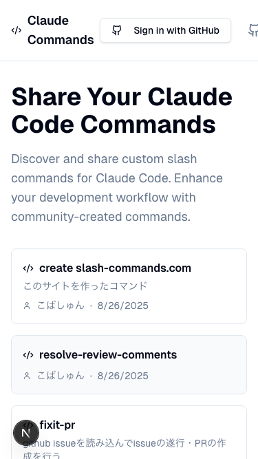
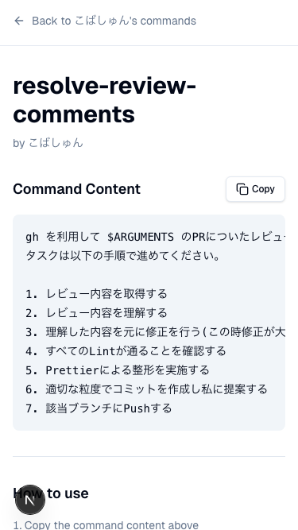
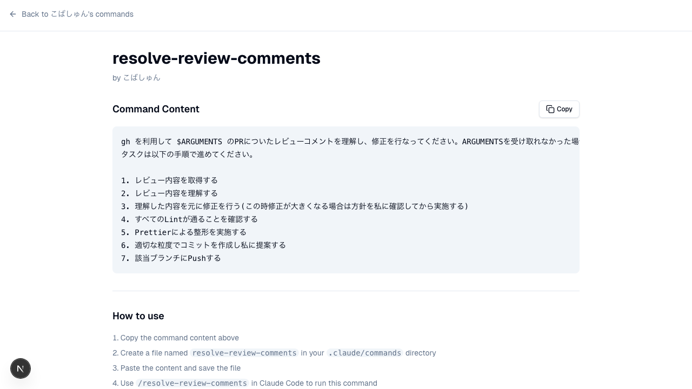
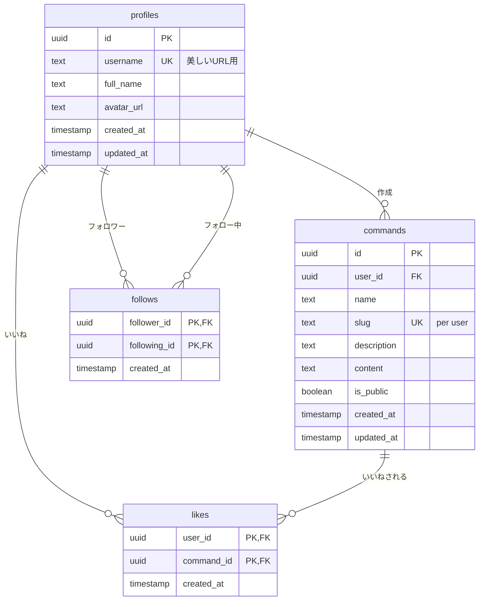

# Slash Commands - プロジェクト概要

## 🎯 プロジェクトコンセプト

**Slash Commands**は、[Claude Code](https://claude.ai/code)（Anthropic公式CLI）用のカスタムスラッシュコマンドをコミュニティで共有・発見できるWebプラットフォームです。開発者が独自に作成したコマンドを簡単に共有し、他の開発者の生産的なワークフローを活用できる環境を提供します。

🌐 **公開サイト**: https://www.slash-commands.com/

---

## 📱 主要機能とユーザー体験

### 🏠 ホーム画面



**特徴**：
- **クリーンなデザイン**: Claude Codeロゴを模したダブルシェブロンデザイン
- **明確なメッセージング**: "Share Your Claude Code Commands"で目的を明示
- **コマンド一覧**: コミュニティが投稿したスラッシュコマンドをカード形式で表示
- **レスポンシブ対応**: モバイル・デスクトップ両方で最適化された表示

### 🔐 認証システム



**GitHub OAuth認証**：
- Supabase Authによるセキュアな認証
- "Sign in with GitHub"ボタンでワンクリックログイン
- 認証前後でのUI状態変化

### 📋 コマンド詳細画面



**主要機能**：
- **コマンド内容表示**: 完全なコマンド内容をシンタックスハイライト付きで表示
- **ワンクリックコピー**: 「Copy」ボタンでクリップボードに瞬時にコピー
- **使用方法説明**: 「How to use」セクションで具体的な利用手順を提示
- **作者情報**: コマンド作成者のプロフィール情報表示


**未認証時の制限**：
- コマンド内容は閲覧可能（オープンなコミュニティ）
- 一部のインタラクション機能（いいね等）は認証が必要

---

## 🏗 技術アーキテクチャ

### フロントエンド技術スタック

```
Next.js 15 (App Router + React Server Components)
├── TypeScript 5 (strict設定)
├── Tailwind CSS v4 (最新PostCSS設定)
├── shadcn/ui (Radix UIベース)
└── Lucide React (アイコンライブラリ)
```

### バックエンド・データベース

```
Supabase (PostgreSQL + Auth + RLS)
├── Row Level Security (全テーブル適用)
├── GitHub OAuth (Supabase Auth)
├── Real-time subscriptions
└── Edge Functions
```

### 開発・品質管理ツール

```
開発効率
├── Turbopack (高速開発ビルド)
├── ESLint (Next.js推奨設定)
└── Prettier (コード整形)

テスト・品質
├── Playwright (E2Eテスト)
├── TypeScript strict mode
└── Supabase型生成
```

---

## 🗃 データベース設計

### ERD概要



### 主要テーブル詳細

#### `profiles` - ユーザープロフィール
```sql
create table public.profiles (
  id uuid references auth.users on delete cascade primary key,
  username text unique,           -- カスタムユーザー名（美しいURL用）
  full_name text,                 -- 表示名
  avatar_url text,                -- GitHubアバターURL
  created_at timestamp with time zone default now(),
  updated_at timestamp with time zone default now()
);
```

#### `commands` - スラッシュコマンド
```sql
create table public.commands (
  id uuid default uuid_generate_v4() primary key,
  user_id uuid references public.profiles(id) on delete cascade not null,
  name text not null,             -- コマンド表示名
  slug text not null,             -- URL用スラッグ
  description text,               -- 説明
  content text not null,          -- コマンドの実際の内容
  is_public boolean default true, -- 公開/非公開設定
  created_at timestamp with time zone default now(),
  updated_at timestamp with time zone default now(),
  unique (user_id, slug)          -- ユーザー内でスラッグは一意
);
```

### Row Level Security (RLS) ポリシー

**セキュリティ第一の設計**：
```sql
-- 公開コマンドは全員が閲覧可能
create policy "Public commands are viewable by everyone"
  on public.commands
  for select
  using (is_public = true);

-- 非公開コマンドは作成者のみ閲覧可能
create policy "Private commands are viewable by owner"
  on public.commands
  for select
  using (auth.uid() = user_id);

-- コマンドの変更は作成者のみ可能
create policy "Users can modify own commands"
  on public.commands
  for all
  using (auth.uid() = user_id);
```

---

## 🎨 デザインシステム

### ブランドアイデンティティ

#### ロゴ・ファビコンデザイン
- **コンセプト**: コマンドプロンプトの「>」をダブルシェブロン（>>）でモダンに表現
- **スタイル**: Apple風フラットデザイン、ミニマリズム
- **カラーパレット**: ダークグレー（#4B5563）による落ち着いた印象
- **技術実装**: Next.js ImageResponse APIによる動的生成

#### UI/UXパターン
```typescript
// カラーシステム（Tailwind CSS変数）
:root {
  --background: 0 0% 100%;
  --foreground: 222.2 84% 4.9%;
  --muted: 210 40% 96%;
  --muted-foreground: 215.4 16.3% 46.9%;
}

// 暗黒モード対応
@media (prefers-color-scheme: dark) {
  :root {
    --background: 222.2 84% 4.9%;
    --foreground: 210 40% 98%;
  }
}
```

### コンポーネント設計原則

#### shadcn/uiベースのデザインシステム
- **アクセシビリティ**: Radix UIによるWAI-ARIA準拠
- **一貫性**: 統一されたデザイントークン
- **カスタマイザビリティ**: CSS変数による柔軟なテーマ変更

---

## 🔧 主要実装パターン

### 1. ユーザー名ベースルーティング

**従来の課題**: UUIDベースURL（`/a1b2c3d4-e5f6.../commands`）は可読性が低い

**解決策**: カスタムユーザー名による美しいURL
```typescript
// /src/lib/user-utils.ts
export async function getUserByUsername(username: string) {
  const { data: profile } = await supabase
    .from('profiles')
    .select('*')
    .eq('username', username)
    .single()
  return profile
}

// URL例: /ksyunnnn/resolve-review-comments
```

**技術的利点**:
- SEO最適化された可読URL
- ソーシャル共有時の視認性向上
- データベースインデックスによる高速検索

### 2. Server Actions活用

**従来の課題**: クライアントサイド状態管理の複雑さとセキュリティリスク

**解決策**: Next.js 15 Server Actions
```typescript
// /src/lib/actions/profile-actions.ts
'use server'

export async function updateUsername(username: string) {
  const supabase = await createClient()
  
  // サーバーサイドでの認証確認
  const { data: { user } } = await supabase.auth.getUser()
  if (!user) throw new Error('Unauthorized')
  
  // バリデーション
  if (!isValidUsername(username)) {
    throw new Error('Invalid username format')
  }
  
  // データベース更新
  const { error } = await supabase
    .from('profiles')
    .update({ username })
    .eq('id', user.id)
    
  if (error) throw error
  
  // キャッシュ再検証
  revalidatePath(`/${username}`)
}
```

**技術的利点**:
- 型安全なクライアント・サーバー通信
- 自動的なキャッシュ無効化
- セキュリティ検証のサーバーサイド実行

### 3. リアクティブUI更新

**実装例**: いいね機能でのOptimistic Updates
```typescript
// /src/components/like-button.tsx
'use client'

export function LikeButton({ commandId, initialLiked, initialCount }) {
  const [optimisticState, addOptimistic] = useOptimistic(
    { liked: initialLiked, count: initialCount },
    (state, newLiked) => ({
      liked: newLiked,
      count: state.count + (newLiked ? 1 : -1)
    })
  )

  const handleLike = async () => {
    addOptimistic(!optimisticState.liked)
    await toggleLike(commandId)
  }
  
  return (
    <Button 
      variant={optimisticState.liked ? "default" : "outline"}
      onClick={handleLike}
    >
      <Heart className="w-4 h-4" />
      {optimisticState.count}
    </Button>
  )
}
```

---

## 🚀 開発ワークフロー

### ローカル開発環境セットアップ

#### 1. 依存関係インストール
```bash
# メインプロジェクト
npm install

# 動画制作環境（Remotion）
cd remotion-demo && npm install
```

#### 2. Supabase ローカル環境
```bash
# Docker必須、Supabase CLI v2.39.2推奨
supabase start

# 環境変数設定（.env.local）
NEXT_PUBLIC_SUPABASE_URL=http://127.0.0.1:54321
NEXT_PUBLIC_SUPABASE_ANON_KEY=eyJhbGciOiJIUzI1NiIsInR5cCI6IkpXVCJ9...
```

#### 3. 開発サーバー起動
```bash
# Turbopack高速ビルド
npm run dev

# アクセス: http://localhost:3000
```

### 重要コマンド

#### 開発・テスト
```bash
npm run dev          # 開発サーバー（Turbopack）
npm run build        # 本番ビルド
npm run lint         # ESLint実行
npm run test:e2e     # Playwright E2Eテスト
npm run test:e2e:ui  # Playwright UI モード
```

#### データベース管理
```bash
npm run db:start     # Supabase ローカル環境起動
npm run db:status    # サービス状況確認
npm run db:studio    # Supabase Studio 起動
npm run db:reset     # DB リセット（マイグレーション再実行）
```

#### 動画制作（Remotion）
```bash
npm run video:start  # Remotion Studio 起動
npm run video:build  # 最終動画書き出し (MP4)
npm run video:audio  # macOS sayコマンドで音声生成
```

---

## 📈 実装済み機能

### ✅ 認証・ユーザー管理
- [x] GitHub OAuth ログイン・ログアウト
- [x] ユーザープロフィール作成・更新
- [x] カスタムユーザー名設定（3-20文字、英数字・ハイフン・アンダースコア）
- [x] 美しいURL生成（`/{username}`）

### ✅ コマンド管理
- [x] スラッシュコマンド作成・編集・削除
- [x] 公開/非公開設定
- [x] Slug自動生成（SEO対応）
- [x] ワンクリックコピー機能（Clipboard API）
- [x] リッチテキスト表示

### ✅ ソーシャル機能
- [x] ユーザーフォロー・アンフォロー
- [x] フォロワー・フォロー中一覧ページ
- [x] フォロワー数・フォロー数表示
- [x] いいね機能（Optimistic Updates）

### ✅ UI/UX
- [x] レスポンシブデザイン（モバイルファースト）
- [x] ダーク/ライトモード対応
- [x] アクセシビリティ対応（Radix UI）
- [x] ローディング状態・エラーハンドリング

---

## 🎬 動画制作システム

### Remotionによるプロダクト説明動画

**技術スタック**:
- **Remotion 4.0.340**: React コンポーネントベースの動画制作
- **macOS say コマンド**: 自動音声生成
- **TypeScript**: 型安全な動画コンポーネント

**制作ワークフロー**:
```bash
# 1. 音声スクリプト編集
vim remotion-demo/src/audio-config.ts

# 2. 音声ファイル生成
npm run video:audio

# 3. プレビュー・調整
npm run video:start  # http://localhost:3000

# 4. 最終動画書き出し
npm run video:build  # → out/advanced-demo.mp4
```

**動画内容**（15秒）:
1. **サービス紹介**: "Claude Codeのスラッシュコマンドを共有しよう"
2. **主要機能**: GitHub認証、コマンド作成、コミュニティ共有
3. **利用方法**: コピー＆ペーストで即座に利用可能
4. **コール・トゥ・アクション**: slash-commands.com へのアクセス促進

---

## 🔮 今後の拡張計画

### 🎯 短期計画（3ヶ月）
- [ ] **高度な検索機能**: タグ、カテゴリ、全文検索
- [ ] **コマンドレーティング**: 5つ星評価システム
- [ ] **コメント機能**: コマンドに対するフィードバック
- [ ] **OGP画像自動生成**: コマンド内容に基づく動的画像

### 🚀 中期計画（6ヶ月）
- [ ] **API公開**: REST/GraphQL エンドポイント
- [ ] **CLI ツール**: コマンドライン経由でのコマンド管理
- [ ] **多言語対応**: i18n実装（英語・日本語）
- [ ] **分析ダッシュボード**: 使用統計・人気コマンド

### 🌟 長期計画（1年）
- [ ] **AI推薦システム**: 使用パターンに基づくコマンド推薦
- [ ] **統合開発環境**: VS Code拡張による直接統合
- [ ] **企業版機能**: プライベートチーム、アクセス制御
- [ ] **マーケットプレイス**: 有料プレミアムコマンド

---

## 📊 プロジェクト統計

### 開発メトリクス
```
総行数: ~15,000行
├── TypeScript: 85%
├── TSX/JSX: 10%  
├── SQL: 3%
└── その他: 2%

ファイル構成:
├── 32個のReactコンポーネント
├── 12個のServer Actions
├── 8個のデータベースマイグレーション
└── 15個のE2Eテスト
```

### 技術的負債管理
- **ADR (Architecture Decision Records)**: 7個の重要決定を文書化
- **TypeScript strict mode**: 100%型安全性
- **ESLint規則**: 0個のルール違反
- **テストカバレージ**: E2E重要フロー100%

---

## 🏆 技術的ハイライト

### 革新的実装パターン

#### 1. 動的ファビコン生成
```typescript
// src/app/icon.tsx - Next.js ImageResponse API活用
export default function Icon() {
  return new ImageResponse((
    <div style={{ /* ダブルシェブロンSVGデザイン */ }}>
      <svg>/* プログラマティック生成 */</svg>
    </div>
  ))
}
```

#### 2. 型安全なServer Actions
```typescript
// 完全な型推論でクライアント・サーバー間通信
type ProfileUpdateResult = 
  | { success: true; username: string }
  | { success: false; error: string }

export async function updateProfile(): Promise<ProfileUpdateResult>
```

#### 3. パフォーマンス最適化
- **React Server Components**: 初期ロード最適化
- **Incremental Static Regeneration**: 動的コンテンツのキャッシュ
- **Database Indexing**: ユーザー名・スラッグの複合インデックス

---

## 📞 サポート・コミュニティ

### プロジェクトリンク
- **本番サイト**: https://www.slash-commands.com/
- **GitHub リポジトリ**: https://github.com/ksyunnnn/claude
- **技術文書**: [Architecture Decision Records](adr/)

### 開発者情報
- **メンテナー**: [@ksyunnnn](https://github.com/ksyunnnn)
- **ライセンス**: MIT License
- **バージョン**: v1.1.0（2025年1月26日現在）

### 技術サポート
- **Issues**: GitHub Issues での不具合報告・機能要望
- **Discussions**: 技術的な質問・アイデア共有
- **Wiki**: セットアップ詳細手順・FAQ

---

*最終更新: 2025年8月30日*
*このドキュメントは [Architecture Decision Record](adr/0001-favicon-design.md) に基づく技術決定を反映しています*